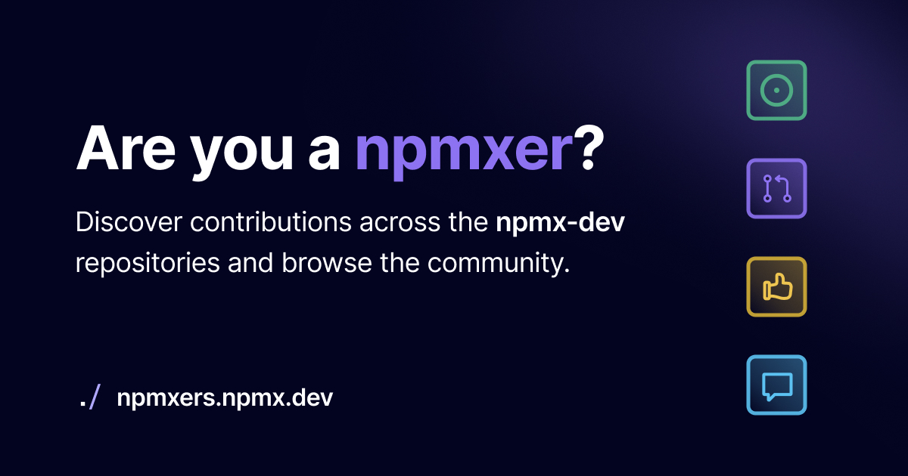

[](https://npmxers.trueberryless.org)

# npmxers

Discover the number of contributions you made to npmx and share your npmxer profile.

https://npmx.dev

## Setup

Install the dependencies with [pnpm](https://pnpm.js.org/en/):

```bash
pnpm install
```

Next, copy the `.env.example` to `.env` and fill the env variables.

## Development

Start the development server on http://localhost:3000:

```bash
pnpm dev
```

## Contributor stats

 - Run `pnpm collect:contributors` locally with `NUXT_GITHUB_TOKEN` set to a GitHub personal access token that can read public repos.
 - The script aggregates contributions across the npmx-dev GitHub organization and writes the results to `public/contributors.json`.
- `.github/workflows/update-contributors.yml` refreshes the data nightly and on demand, committing changes automatically.

## Credits & Attribution

This project is a fork and adapted version of [Nuxters](https://github.com/nuxt/nuxters), built by the Nuxt team. Huge thanks to the original creators for open-sourcing their codebase!

## License

[MIT License](./LICENSE)
